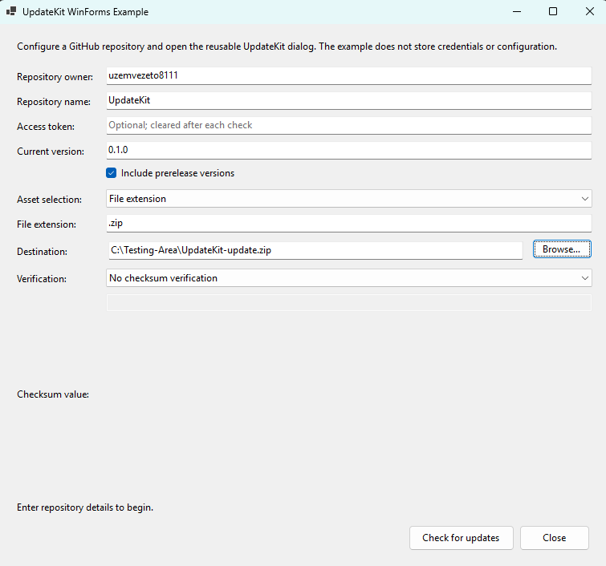
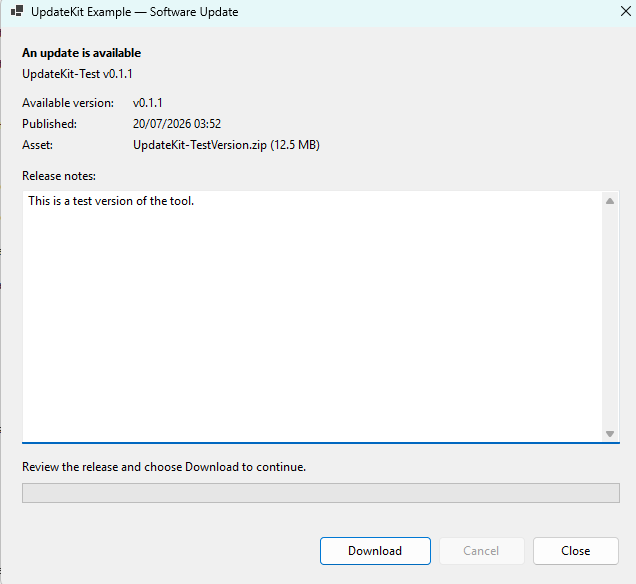
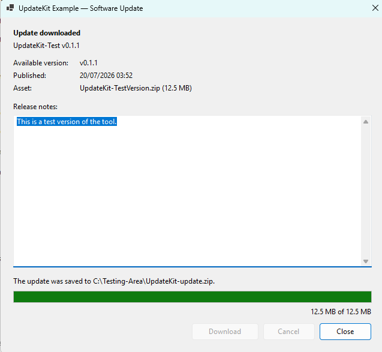

# UpdateKit

**A focused .NET 8 toolkit for shipping application updates through GitHub Releases.**

UpdateKit handles the update path from release discovery to a safely committed download: Semantic Versioning comparison, deterministic asset selection, streamed transfer with progress and cancellation, optional SHA-256 verification, and reusable native Windows UI. The Core library remains UI-independent, while dedicated WinForms and WPF packages provide ready-to-host experiences without duplicating update logic.

> UpdateKit is currently an early pre-release. Public APIs may change before a stable release.

The repository is split into three libraries and three practical samples:

- `UpdateKit.Core` - platform-neutral GitHub release retrieval, Semantic Versioning, asset selection, safe downloading, and SHA-256 verification.
- `UpdateKit.WinForms` - a reusable, DPI-aware update dialog powered entirely by the Core API.
- `UpdateKit.Wpf` - a reusable update window with a public, bindable view model and Core-backed commands.
- `UpdateKit.Minimal.WinForms` - the smallest practical integration: one form, one button, and no duplicated updater logic.
- `UpdateKit.Minimal.Wpf` - the equivalent one-window, one-button WPF integration.
- `UpdateKit.Example.WinForms` - an interactive host that demonstrates configuration, ownership, validation, and the complete dialog workflow.

## Features

- **Find the right release** - retrieve paginated GitHub Releases, exclude drafts, opt into prereleases, and compare `1.2.3` or `v1.2.3` tags according to Semantic Versioning 2.0.0.
- **Select deterministically** - choose the first asset by exact name, normalized case-insensitive extension, or a caller-provided predicate.
- **Download without partial success** - stream into a unique temporary file, report byte and percentage progress, support cancellation and configurable transient retries, and replace the destination only after a complete transfer.
- **Preserve existing files** - keep an existing destination intact when requests, streaming, cancellation, or pre-commit file operations fail.
- **Verify what was downloaded** - validate a direct SHA-256 value or resolve the matching filename from a standard checksum-file asset; delete mismatched downloads.
- **Host a native update experience** - show release name, version, notes, publication date, selected asset, progress, cancellation, completion, and actionable errors in reusable WinForms or WPF UI; WinForms hosts can opt into centralized System, Light, or Dark theming.
- **Compose with MVVM** - bind a custom WPF view directly to `UpdateWindowViewModel`, its presentation properties, and its check, download, and cancellation commands.
- **Handle failures explicitly** - branch on stable `UpdateErrorCode` values instead of parsing exception or message text.
- **Test without live services** - run 353 deterministic automated tests backed by custom HTTP handlers rather than the real GitHub API.

## Screenshots

### Configure the example application



*The example host collects repository, installed-version, prerelease, asset-selection, destination, and verification settings. The optional access token remains blank and is never persisted.*

> This capture predates the new **Tools > Settings** entry. The configuration workflow remains representative; a future documentation-only refresh will include the settings menu and theme dialog.

### Review an available update



*The reusable dialog presents the release version, publication date, selected asset, and release notes before the user starts the download.*

### Confirm download completion



*After a successful streamed transfer, the dialog shows the final destination, completed byte count, and a clear completion state.*

## For application users

Download `UpdateKit.Example.WinForms-win-x64.zip` from the matching GitHub Release, verify it against `SHA256SUMS.txt`, and extract the complete ZIP. Then double-click `UpdateKit.Example.WinForms.exe`. This Windows x64 build is self-contained and requires no installed .NET runtime, SDK, or terminal.

The executable is an interactive demonstration and configuration client for UpdateKit. It can check a configured GitHub repository, display releases, select and download assets, report progress, and demonstrate checksum verification. It does **not** inject update support into unrelated or already-installed applications; application developers integrate the UpdateKit libraries into their own source code.

Release executables are currently unsigned because the project has no code-signing certificate. Windows SmartScreen may therefore display an unknown-publisher warning. Confirm the ZIP's SHA-256 checksum before extracting it and download releases only from the official [UpdateKit repository](https://github.com/uzemvezeto8111/UpdateKit/releases).

## For developers

Clone the repository to build from source, run the samples, or reference `UpdateKit.Core`, `UpdateKit.WinForms`, or `UpdateKit.Wpf` from your application. Versioned NuGet packages for Core and WinForms are attached to GitHub Releases but are not automatically published to NuGet.org. The integration examples below show caller-owned `HttpClient`, update checks, asset selection, safe downloading, verification, and reusable desktop UI.

## Supported platforms

| Project | Target | Runtime support |
| --- | --- | --- |
| `UpdateKit.Core` | `net8.0` | Any .NET 8 platform providing the required HTTP and file-system APIs |
| `UpdateKit.WinForms` | `net8.0-windows` | Windows with the .NET 8 Desktop Runtime |
| `UpdateKit.Wpf` | `net8.0-windows` | Windows with the .NET 8 Desktop Runtime |
| `UpdateKit.Minimal.WinForms` | `net8.0-windows` | Windows with the .NET 8 Desktop Runtime |
| `UpdateKit.Minimal.Wpf` | `net8.0-windows` | Windows with the .NET 8 Desktop Runtime |
| `UpdateKit.Example.WinForms` | `net8.0-windows` | Windows with the .NET 8 Desktop Runtime |

Only GitHub-hosted repositories are supported by the release source. Tags must be valid Semantic Versioning 2.0.0 values with an optional lowercase `v` prefix. Draft releases are always excluded; prereleases are excluded unless `IncludePrereleases` is enabled.

## Prerequisites

- [.NET 8 SDK](https://dotnet.microsoft.com/download/dotnet/8.0)
- Windows when building or running the WinForms and WPF projects
- Git for cloning and contributing

## Build and test

```powershell
git clone <repository-url>
cd UpdateKit
dotnet restore UpdateKit.sln
dotnet build UpdateKit.sln --configuration Release --no-restore
dotnet test UpdateKit.sln --configuration Release --no-build --no-restore
```

Run the example on Windows:

```powershell
dotnet run --project samples/UpdateKit.Example.WinForms/UpdateKit.Example.WinForms.csproj
```

### Publish a standalone Windows executable

To produce a clickable Windows x64 executable that does not require an installed .NET runtime or SDK on the destination computer, run this repository script from Command Prompt on a development computer with the .NET 8 SDK:

```cmd
eng\publish-example.cmd
```

The script performs the following Release publish:

```cmd
dotnet publish samples\UpdateKit.Example.WinForms\UpdateKit.Example.WinForms.csproj ^
  --configuration Release ^
  --runtime win-x64 ^
  --self-contained true ^
  -p:PublishProfile=WinX64SelfContained ^
  -p:PublishSingleFile=true ^
  -p:PublishTrimmed=false ^
  -p:DebugType=None ^
  -p:DebugSymbols=false ^
  --output artifacts\publish\UpdateKit.Example.WinForms\win-x64
```

Launch the resulting file directly from Explorer:

```text
artifacts\publish\UpdateKit.Example.WinForms\win-x64\UpdateKit.Example.WinForms.exe
```

The published application is self-contained, single-file, and does not include PDB files. Trimming remains disabled because WinForms and reflection-dependent framework behavior have not been proven trim-safe for this application. ReadyToRun is also disabled: the compressed single-file build is reliable without the additional size and publishing complexity. The repository's `.gitignore` excludes the complete `artifacts/` directory, so locally published executables are not added to source control. Developers can also invoke the checked-in `WinX64SelfContained` publish profile directly with `-p:PublishProfile=WinX64SelfContained`.

For a complete distributable release—including the executable, user README, license, ZIP, NuGet packages, and SHA-256 manifest—run:

```cmd
eng\build-release.cmd
```

No application icon is invented or bundled yet. To provide the final icon later, add an authentic Windows icon at `samples\UpdateKit.Example.WinForms\Assets\UpdateKit.ico`; the project conditionally applies that file through `ApplicationIcon` when it exists.

### Example application settings

The full WinForms example includes **Tools > Settings** (`Ctrl+,`) and applies appearance changes immediately. Choose **System** to resolve the Windows application theme each time the example starts, or choose **Light** or **Dark** for an explicit palette. The selected palette covers the main form, settings dialog, reusable update dialog, menus, inputs, buttons, release notes, status/error surfaces, and progress display.

The example can remember prerelease eligibility, startup checking, download confirmation, successful-download folder opening, repository owner/name, asset-selection mode/value, destination directory, default download directory, and bounded retry count/delay. Each remember option is independently configurable. Settings use versioned JSON stored per user at:

```text
%LocalAppData%\UpdateKit\Example.WinForms\settings.json
```

Writes are staged beside the destination and atomically committed. Missing, partial, malformed, unreadable, or newer unsupported settings fall back safely without preventing startup. **GitHub access tokens are never part of the settings model and are never serialized or persisted.** The settings dialog also provides a confirmation-protected **Clear saved settings** action.

When automatic checking is enabled, the example waits until its main window is visible, validates the restored configuration, and starts at most one automatic check. It skips the check if required repository or destination values are missing. Opening the destination folder occurs only after a confirmed successful download; shell failures are presented as nonfatal UI errors.

WinForms hosts can opt into the same reusable theme without adopting the example settings system:

```csharp
using UpdateKit.WinForms;

var dialogOptions = new UpdateDialogOptions(
    client,
    currentVersion,
    destinationPath,
    release => client.SelectAssetByExtension(release, ".zip"))
{
    Theme = ApplicationTheme.System, // Or Light or Dark.
    ConfirmBeforeDownload = true,
};
```

Leaving `Theme` unset preserves UpdateKit's original platform-native dialog appearance. `WinFormsThemeManager` and its read-only `ThemePalette` are also available to hosts that want the same colors on their own WinForms control trees. Settings persistence intentionally remains in the example rather than `UpdateKit.Core`.

Run the minimal WPF sample:

```powershell
dotnet run --project samples/UpdateKit.Minimal.Wpf/UpdateKit.Minimal.Wpf.csproj
```

## Integrate UpdateKit in five minutes

Run the included minimal sample from the repository root:

```powershell
dotnet restore UpdateKit.sln
dotnet run `
  --project samples/UpdateKit.Minimal.WinForms/UpdateKit.Minimal.WinForms.csproj `
  --configuration Release
```

For an existing WinForms project, add references to both libraries:

```powershell
dotnet add path/to/YourApp.csproj reference src/UpdateKit.Core/UpdateKit.Core.csproj
dotnet add path/to/YourApp.csproj reference src/UpdateKit.WinForms/UpdateKit.WinForms.csproj
```

Use the standard WinForms entry point from [Program.cs](samples/UpdateKit.Minimal.WinForms/Program.cs):

```csharp
namespace UpdateKit.Minimal.WinForms;

internal static class Program
{
    [STAThread]
    private static void Main()
    {
        Application.SetHighDpiMode(HighDpiMode.PerMonitorV2);
        Application.EnableVisualStyles();
        Application.SetCompatibleTextRenderingDefault(false);
        Application.Run(new MainForm());
    }
}
```

Then add one form with one button. The five values grouped at the top are the only host-specific values required by this baseline. This is the complete [MainForm.cs](samples/UpdateKit.Minimal.WinForms/MainForm.cs):

```csharp
using UpdateKit.WinForms;

namespace UpdateKit.Minimal.WinForms;

internal sealed class MainForm : Form
{
    // CHANGE THESE FIVE VALUES for your application.
    private const string RepositoryOwner = "uzemvezeto8111"; // CHANGE THIS.
    private const string RepositoryName = "UpdateKit"; // CHANGE THIS.
    private const string CurrentVersion = "0.0.0"; // CHANGE THIS to your installed version.
    private const string AssetExtension = ".nupkg"; // CHANGE THIS to your release asset type.
    private static readonly string DestinationPath = // CHANGE THIS to your installer/package path.
        Path.Combine(Path.GetTempPath(), "UpdateKit.Minimal.WinForms-update.nupkg");

    private readonly HttpClient _httpClient;
    private readonly UpdateClient _updateClient;
    private readonly Button _checkForUpdatesButton = new();

    public MainForm()
    {
        _httpClient = new HttpClient();
        _updateClient = new UpdateClient(
            _httpClient,
            new UpdateClientOptions
            {
                RepositoryOwner = RepositoryOwner,
                RepositoryName = RepositoryName,
                IncludePrereleases = true,
                UserAgent = "UpdateKit.Minimal.WinForms",
            });

        Text = "Minimal UpdateKit Sample";
        StartPosition = FormStartPosition.CenterScreen;
        AutoScaleMode = AutoScaleMode.Dpi;
        ClientSize = new Size(360, 120);

        _checkForUpdatesButton.Text = "Check for updates";
        _checkForUpdatesButton.AutoSize = true;
        _checkForUpdatesButton.Anchor = AnchorStyles.None;
        _checkForUpdatesButton.AccessibleName = "Check for updates";
        _checkForUpdatesButton.Click += CheckForUpdatesButton_Click;

        Controls.Add(_checkForUpdatesButton);
        AcceptButton = _checkForUpdatesButton;
    }

    protected override void OnLayout(LayoutEventArgs e)
    {
        base.OnLayout(e);
        _checkForUpdatesButton.Location = new Point(
            (ClientSize.Width - _checkForUpdatesButton.Width) / 2,
            (ClientSize.Height - _checkForUpdatesButton.Height) / 2);
    }

    protected override void Dispose(bool disposing)
    {
        if (disposing)
        {
            _httpClient.Dispose();
        }

        base.Dispose(disposing);
    }

    private void CheckForUpdatesButton_Click(object? sender, EventArgs e)
    {
        var options = new UpdateDialogOptions(
            _updateClient,
            CurrentVersion,
            DestinationPath,
            release => _updateClient.SelectAssetByExtension(release, AssetExtension))
        {
            DialogTitle = "Software Update",
        };

        using var dialog = new UpdateDialog(options);
        dialog.ShowDialog(this);
    }
}
```

`MainForm` owns one `HttpClient` for its lifetime and disposes it with the form. `UpdateClient` borrows that client, and every button click creates and disposes a fresh single-use `UpdateDialog`. Release retrieval, comparison, selection, downloading, progress, cancellation, and error presentation all remain inside UpdateKit.

## Installation

No public package feed is configured by this repository. During source development, reference the projects directly:

```xml
<ItemGroup>
  <ProjectReference Include="path/to/UpdateKit/src/UpdateKit.Core/UpdateKit.Core.csproj" />
  <ProjectReference Include="path/to/UpdateKit/src/UpdateKit.WinForms/UpdateKit.WinForms.csproj" />
  <ProjectReference Include="path/to/UpdateKit/src/UpdateKit.Wpf/UpdateKit.Wpf.csproj" />
</ItemGroup>
```

The three library projects contain NuGet metadata and can be packed locally:

```powershell
dotnet pack src/UpdateKit.Core/UpdateKit.Core.csproj --configuration Release
dotnet pack src/UpdateKit.WinForms/UpdateKit.WinForms.csproj --configuration Release
dotnet pack src/UpdateKit.Wpf/UpdateKit.Wpf.csproj --configuration Release
```

## Core API quick start

The caller owns the `HttpClient`. Keep it alive for every update operation that uses the `UpdateClient`, then dispose it according to the host application's normal lifetime policy.

```csharp
using UpdateKit;

using var httpClient = new HttpClient();
var client = new UpdateClient(
    httpClient,
    new UpdateClientOptions
    {
        RepositoryOwner = "owner",
        RepositoryName = "repository",
        AccessToken = Environment.GetEnvironmentVariable("GITHUB_TOKEN"),
        IncludePrereleases = false,
        UserAgent = "MyProduct-Updater",
        DownloadRetry = new DownloadRetryOptions
        {
            MaxRetryAttempts = 3,
            InitialDelay = TimeSpan.FromSeconds(1),
            MaximumDelay = TimeSpan.FromSeconds(8),
            JitterFactor = 0.2,
            RetryProgress = new Progress<DownloadRetryAttempt>(attempt =>
                Console.WriteLine(
                    $"Retry {attempt.RetryNumber}/{attempt.MaximumRetryAttempts} " +
                    $"in {attempt.Delay.TotalSeconds:F1}s")),
        },
    });

using var cancellation = new CancellationTokenSource();
var check = await client.CheckForUpdateAsync("1.2.3", cancellation.Token);

if (!check.IsSuccess)
{
    Console.Error.WriteLine($"{check.Error.Code}: {check.Error.Message}");
    return;
}

if (!check.Value.IsUpdateAvailable)
{
    Console.WriteLine("The application is current.");
    return;
}

var asset = client.SelectAssetByExtension(check.Value.LatestRelease, ".zip");
if (!asset.IsSuccess)
{
    Console.Error.WriteLine(asset.Error.Message);
    return;
}

var destination = Path.GetFullPath("MyProduct-update.zip");
var progress = new Progress<DownloadProgress>(value =>
{
    var display = value.Percentage is { } percentage
        ? $"{percentage:F1}%"
        : $"{value.BytesDownloaded:N0} bytes";
    Console.WriteLine(display);
});

var download = await client.DownloadAsync(
    asset.Value,
    destination,
    progress,
    cancellation.Token);

if (!download.IsSuccess)
{
    Console.Error.WriteLine($"{download.Error.Code}: {download.Error.Message}");
}
```

Exact-name and predicate selection are also available through `SelectAssetByExactName` and `SelectAssetByPredicate`. Selection returns the first matching release asset in GitHub response order. Exact names are case-sensitive; extensions are normalized to a leading dot and matched without case sensitivity.

### Download retry contract

Retries are opt-in. `MaxRetryAttempts` defaults to `0`, so existing callers make one request exactly as before. A value of `3` permits at most four HTTP attempts: the initial attempt plus three retries. Configuration accepts 0–100 retries, non-negative delays up to `Int32.MaxValue` milliseconds with `MaximumDelay >= InitialDelay`, and a finite jitter factor from 0 through 1; invalid values fail client or downloader construction with `UpdateConfigurationException`.

UpdateKit retries only these failures:

- HTTP `408`, `429`, `500`, `502`, `503`, and `504` responses;
- transport failures represented by `HttpRequestException` without a permanent status code; and
- `IOException` or `HttpRequestException` failures while opening or reading the HTTP response stream.

It does not retry caller cancellation, internal cancellation or timeout, invalid options or paths, invalid redirects, authentication failures, other HTTP statuses, destination writes or commits, checksum retrieval/parsing failures, or checksum mismatches. Checksum verification begins only after a successful download, so it never causes the asset download to repeat.

For retry number `n`, starting at one, the base delay is `min(MaximumDelay, InitialDelay × 2^(n-1))`. `JitterFactor` is optional and ranges from `0` to `1`; when nonzero it applies a random multiplier in `[1 - JitterFactor, 1 + JitterFactor]`, then caps the result at `MaximumDelay`. `RetryProgress`, when supplied, receives one `DownloadRetryAttempt` immediately before each delay with the retry number, bounded delay, and triggering status or exception. Cancellation during that delay returns `DownloadCanceled` and prevents the next request.

Every retry starts a new HTTP request from byte zero and uses a newly named temporary file. UpdateKit does not send `Range` requests or resume partial transfers. A failed attempt is cleaned up before the next one, and an existing destination remains untouched until one complete attempt is committed successfully. `DownloadProgress` therefore restarts at zero for each transfer attempt.

## SHA-256 verification

For a checksum supplied by a trusted source:

```csharp
var verified = await client.DownloadAndVerifyAsync(
    asset.Value,
    destination,
    expectedSha256,
    progress,
    cancellation.Token);
```

For a checksum stored in another asset on the same release:

```csharp
var checksumAsset = client.SelectAssetByExactName(
    check.Value.LatestRelease,
    "SHA256SUMS.txt");

if (!checksumAsset.IsSuccess)
{
    Console.Error.WriteLine(checksumAsset.Error.Message);
    return;
}

var verified = await client.DownloadAndVerifyFromChecksumFileAsync(
    asset.Value,
    destination,
    checksumAsset.Value,
    progress,
    cancellation.Token);
```

Checksum files accept standard lines containing a 64-character hexadecimal SHA-256 value, whitespace, an optional `*` binary marker, and a filename. Filename matching is ordinal and case-sensitive. Duplicate identical entries are accepted; conflicting duplicates fail as `InvalidChecksum`. A mismatch returns `ChecksumMismatch` and deletes the downloaded file. If that deletion fails, the operation returns `FileSystemError` and the caller should treat the file as untrusted.

## Windows Forms dialog

Create a new `UpdateDialog` for every display. The dialog does not own or dispose its `UpdateClient` or the client's `HttpClient`.

```csharp
using UpdateKit;
using UpdateKit.WinForms;

using var httpClient = new HttpClient();
var client = new UpdateClient(httpClient, clientOptions);

var dialogOptions = new UpdateDialogOptions(
    client,
    currentVersion: "1.2.3",
    destinationFilePath: Path.GetFullPath("MyProduct-update.zip"),
    assetSelector: release => client.SelectAssetByExtension(release, ".zip"))
{
    DialogTitle = "MyProduct Update",
    ChecksumAssetSelector = release =>
        client.SelectAssetByExactName(release, "SHA256SUMS.txt"),
};

using var dialog = new UpdateDialog(dialogOptions);
dialog.ShowDialog(this);

if (dialog.DownloadResult is { } completed)
{
    MessageBox.Show($"Saved to {completed.FilePath}");
}
else if (dialog.LastError is { } error)
{
    MessageBox.Show($"{error.Code}: {error.Message}");
}
```

Set either `ExpectedSha256` or `ChecksumAssetSelector`, never both. By default the dialog checks when first shown. Set `CheckForUpdateOnShown = false` when the host needs to call `CheckForUpdateAsync` itself. The dialog is single-use, prevents concurrent operations, marshals state to the UI thread, cancels active work before closing, and exposes the final check, selected asset, download, and error results.

## WPF update window

The WPF package follows the same ownership and host-configuration model. Create a new `UpdateWindow` for each display and set its `Owner`; the window borrows the configured `UpdateClient` and does not dispose it or its `HttpClient`.

```csharp
using UpdateKit;
using UpdateKit.Wpf;

var windowOptions = new UpdateWindowOptions(
    client,
    currentVersion: "1.2.3",
    destinationFilePath: Path.GetFullPath("MyProduct-update.zip"),
    assetSelector: release => client.SelectAssetByExtension(release, ".zip"))
{
    WindowTitle = "MyProduct Update",
    ChecksumAssetSelector = release =>
        client.SelectAssetByExactName(release, "SHA256SUMS.txt"),
};

var updateWindow = new UpdateWindow(windowOptions)
{
    Owner = this,
};
updateWindow.ShowDialog();

if (updateWindow.DownloadResult is { } completed)
{
    MessageBox.Show($"Saved to {completed.FilePath}");
}
else if (updateWindow.LastError is { } error)
{
    MessageBox.Show($"{error.Code}: {error.Message}");
}
```

Use `ExpectedSha256` instead of `ChecksumAssetSelector` for direct verification. Set `CheckForUpdateOnLoaded = false` when the host starts checks itself. The public `UpdateWindowViewModel` exposes bindable release details, progress, errors, state flags, and `ICommand` properties for custom MVVM views. Create it on the UI thread so background progress notifications are marshaled back to that synchronization context, and dispose it when the view closes. Both the standard window and view model prevent concurrent operations and request cancellation before allowing an active workflow to close.

## Authentication and security

`AccessToken` is optional for public repositories and required when GitHub requires authentication for release metadata or asset bytes. UpdateKit does not persist the token or place it in `HttpClient.DefaultRequestHeaders`.

Authenticated downloads use GitHub's release-asset API URL, not `browser_download_url`. UpdateKit accepts that API URL only when it is an HTTPS, default-port `api.github.com/repos/{owner}/{repository}/releases/assets/{id}` endpoint matching the repository and asset ID from the release response. The initial API request receives `Authorization: Bearer`, `Accept: application/octet-stream`, the configured user agent, and the GitHub API-version header.

Redirect requests constructed by UpdateKit never receive library-added authorization or GitHub API headers. HTTPS downloads cannot redirect to plain HTTP, and surfaced redirect chains are limited to ten redirects. Without a token, or for assets without verified GitHub API metadata, UpdateKit retains the existing public behavior and requests `browser_download_url` without credentials. The same policy applies when a checksum-file asset is retrieved.

The caller still owns the injected `HttpClient` and its handler chain. The standard .NET handler clears `Authorization` during automatic redirects; UpdateKit also strips credentials when it handles a surfaced redirect. Other non-credential request headers are governed by that handler. A caller-provided custom handler is part of the host's security boundary and must not copy authorization headers to redirected requests. Do not put GitHub tokens in `HttpClient.DefaultRequestHeaders`, because those defaults are controlled by the caller and can apply to unrelated hosts.

Hosts should obtain tokens from a protected credential source such as an environment variable or operating-system credential store—never source code or logs—and grant only the repository access required by the application. GitHub API `401` or `403` responses during an authenticated asset request map to `AuthenticationFailed`. Without authentication, a private asset's browser URL failure maps to the normal `DownloadFailed` result because the asset layer cannot distinguish a private asset from an unavailable public one.

Always obtain expected checksums through a trusted channel. A checksum published beside a compromised binary protects against transfer corruption but cannot establish publisher authenticity by itself.

## Cancellation, progress, and file safety

- Caller cancellation during a GitHub release check propagates `OperationCanceledException`.
- Download and verification cancellation returns a failed result with `UpdateErrorCode.DownloadCanceled`.
- `DownloadProgress.TotalBytes` and `Percentage` are `null` when the server omits `Content-Length`.
- Downloads use a unique temporary file in the destination directory.
- The destination is replaced only after the complete transfer succeeds.
- Existing destination files survive HTTP, streaming, cancellation, and pre-commit file-system failures.
- Incomplete temporary-file cleanup is attempted on every handled failure path; an external file lock or permission change can prevent best-effort cleanup.

The destination must be an absolute file path whose parent directory already exists.

## Error handling

Expected operational failures use `UpdateResult<T>`. Check `IsSuccess` before reading `Value` or `Error`. Configuration supplied to the `UpdateClient` constructor is validated immediately and can throw `UpdateConfigurationException`; null required objects can throw the usual argument exceptions.

Stable error categories include configuration, authentication, repository lookup, rate limits, malformed responses, invalid versions, missing assets, download/cancellation failures, file-system failures, and checksum failures. Use `UpdateErrorCode` for branching and `UpdateError.Message` for user-facing context.

## More documentation

- [Getting started](docs/GETTING_STARTED.md)
- [Release process and dry run](docs/RELEASING.md)
- [Media capture guide](docs/assets/CAPTURE_GUIDE.md)
- [Minimal WinForms integration sample](samples/UpdateKit.Minimal.WinForms)
- [Minimal WPF integration sample](samples/UpdateKit.Minimal.Wpf)
- [WinForms example project](samples/UpdateKit.Example.WinForms)
- [Contributing](CONTRIBUTING.md)
- [Security policy](SECURITY.md)

## License

UpdateKit is licensed under the [MIT License](LICENSE).
